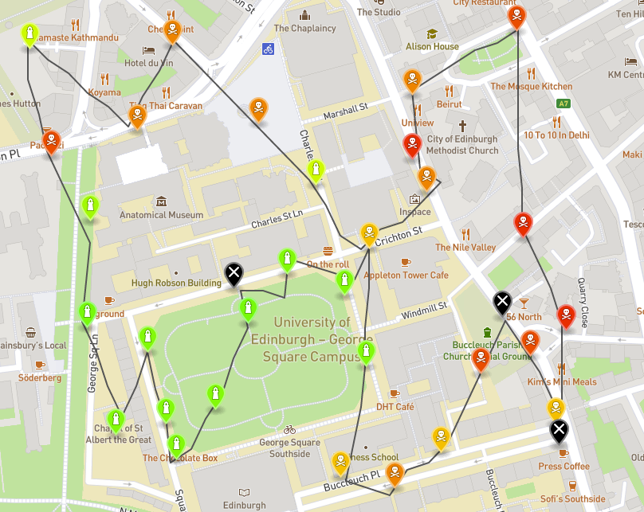
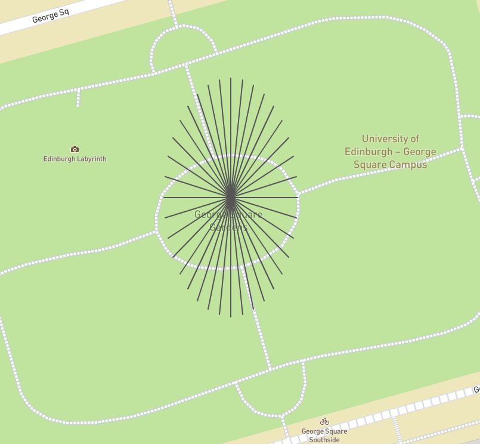
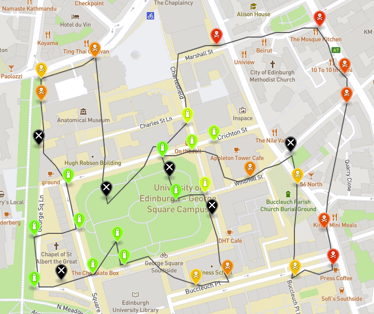
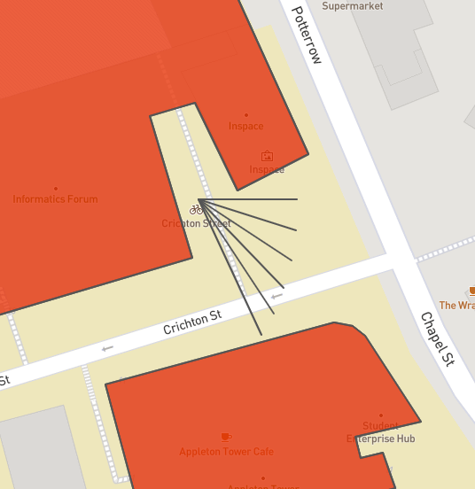
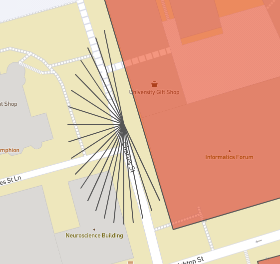

# Drone control software for reading air quality sensors

Software prototype that fetches input data from the webserver,
uses drone to collect sensor readings and outputs the air quality map in a GeoJSON format.

Example of the drone path and air quality map

## Drone
- **longitude** and **latitude** is used to determine coordinates
- can move in an arbitrary direction (in multiples of **10** degrees) between **0 - 350** degrees, by convention, **0º** means EAST, **90º** means NORTH, **180º** means WEST,
**270º** means SOUTH
- can make at most **150** moves
- each move is a straight line and has a length of **0.0003** degrees
- must stay in **bounded area** and avoid **no-fly zones**
- must make at least one **move before each reading**

Possible moves from a location. Stretch is caused by measuring distances in degrees.

## Sensors
- have a **location** in What3Words format
- have a **battery level**
- have a **reading value**
- have a reading range of **0.0002** degrees
        
## Fetching the data
Fetching is done by using Java's HTTP Client.
At first, a list of sensors that need to be read is fetched.
Then the information about the What3Words location is fetched from webserver a parsed to longitude and latitude format.
Lastly, the list of no-fly zones is fetched and parsed.

## Air quality map
Readings collected by the drone are evaluated and output as a GeoJSON file that can be visualised e.g. at http://geojson.io/

## Handling of edge cases
- If the drone makes 150 moves it stops at its location and prints it to the console. 
- If the reading fails the involved sensor is moved to the end of the list of unvisited sensors so the drone can try to make reading at the end of the flight.
- If the sensor's battery level is less than 10 then the reading value can not be trusted. The sensor is marked with X.

## Class diagram

## Drone control algorithm

The implementation of the drone control algorithm in this application is split into 2 main parts:
1. **Determining the order in which to visit all the sensors.**
This is done in the Graph class. The problem is in general known as the Traveling salesman problem –
finding a Hamiltonian cycle in a graph. This application finds nearly optimal visit order by the following
sequence of steps: 
    * A straight-line distance is computed for all pairs of points - nodes in the input and stored in distance matrix. 
    * The visit order is first determined by a greedy algorithm that follows the problem-solving heuristic of choosing the closest node at each point. 
    * An optimization is attempted multiple times by looking at sequences of varying sizes in the current visit order. If a particular sequence, when reversed, results in reducing the overall length of the path given by the current visit order, it is reversed.
 
    A problem (increasing path length) with this approach could occur if many no-fly zones were present. 
    
    Drone flightpath for 18.08.2020 made in 104 moves. Greedy order, without further
    optimization. Starts at 55.944425° latitude, -3.188396° longitude. 
    
    
    
    Drone flightpath for 18.08.2020 made in 94 moves. With optimization. Starts at 55.944425°
    latitude, -3.188396° longitude.
    
    

2. **Finding a path from current position to the next sensor.**
This is done in the Path class. The drone is restricted in its ability to move by a specified move length and a set of directions in which it can move. This makes it possible to identify a finite set of possible moves
at any position of the drone, excluding the ones crossing no-fly zones. 

    The algorithm that this application uses to find a sequence of moves for the drone to execute to get to a target location is called the weighted A* **(A star) algorithm**. This algorithm maintains its search space as a tree of paths originating at the start position and at each
    iteration expands the path that is evaluated by a heuristic function to be the most promising (minimal).
    The heuristic function evaluates each path as follows: **heuristic value = path length + epsilon (weight) * distance to target point**. If epsilon = 1 the algorithm is a classic A* and the heuristic is admissible. A
    heuristic is called admissible if it never overestimates the actual cost of the path. An A* with admissible
    heuristic is always guaranteed to find the optimal path to target if there exists one. However, this can
    take a considerably long time to compute. Choosing epsilon > 1 prioritizes expanding nodes closer to the target, therefore reduces the time that it takes to find the path significantly. This is now called the
    epsilon-admissible heuristic. Path found in this way is guaranteed to be at most (optimal path length * epsilon) long. In this application epsilon = 2 is used in the algorithm. It produced the most consistent
    and fast results in testing phase.
    After finding a path to sensor. The drone moves there (if it can) to read the sensor. This ensures the lifecycle of the drone as stated in the coursework specification document.
    The combination of these 2 processes results in average of around 88 moves per routine for all days on the test server.
    
    
    Avoiding no-fly zones by disregarding moves that cross the no-fly zones during the
    computation of possible moves. 
     
    
    
     

## Server
-not included

Strucutre:
- buildings/no-fly-zones.geojson
- maps/*YYYY*/*MM*/*DD*/air-quality-data.json
- words/*word1*/*word2*/*word3*/details.json

## Build and run
- Package the project to a .jar by using maven build.
- Run the webserver with the required data
- Run the .jar file with these command-line attributes: day month year startLatitude startLogitude seed port
- day - DD, month - MM, year - YYYY, startLatitude and startLongitude in the bounded area, seed is not used(use whatever value), port - port of the webserver
